# TRƯỜNG ĐẠI HỌC CÔNG NGHỆ TP. HỒ CHÍ MINH (HUTECH)
### KHOA CÔNG NGHỆ THÔNG TIN
**Môn học:** Thực hành Lập trình An toàn thông tin  
**Họ và Tên:** Trần Minh Khang - **MSSV:** 2387700027 - **Lớp:** 23DATA1  
**GitHub:** [khang1233/TH_LTANTT_2387700027](https://github.com/khang1233/TH_LTANTT_2387700027.git)  

---

## BÁO CÁO THỰC HÀNH - BÀI 1: LẬP TRÌNH CƠ BẢN VỚI PYTHON

---

### Hình 1: Kết quả chạy chương trình hello.py
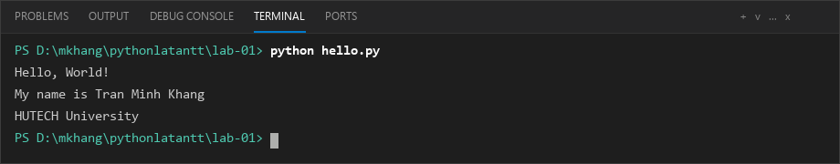

---

### Hình 2: Kết quả thực thi ex02_01.py (Nhập họ tên và tuổi)
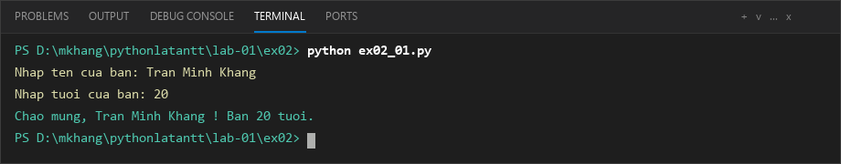

---

### Hình 3: Kết quả thực thi ex02_02.py (Tính diện tích hình tròn)
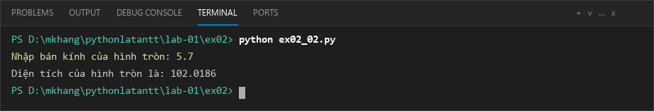

---

### Hình 4: Kết quả thực thi ex02_03.py (Kiểm tra số chẵn / số lẻ)
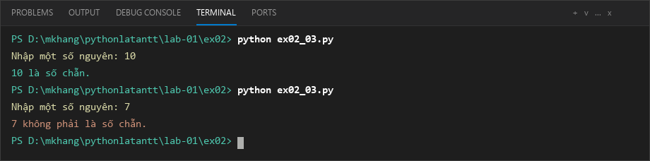

---

### Hình 5: Kết quả thực thi ex02_04.py (Dãy số chia hết cho 7 không chia hết cho 5)
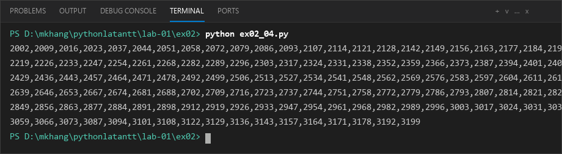

---

### Hình 6: Kết quả thực thi ex02_05.py (Tính tiền lương nhân viên)
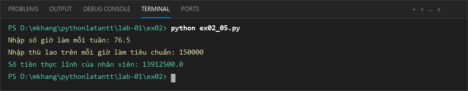

---

### Hình 7: Kết quả thực thi ex02_06.py (Tạo mảng 2 chiều X x Y)
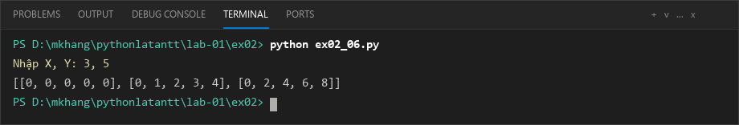

---

### Hình 8: Kết quả thực thi ex02_07.py (Chuyển chuỗi thành chữ in hoa)
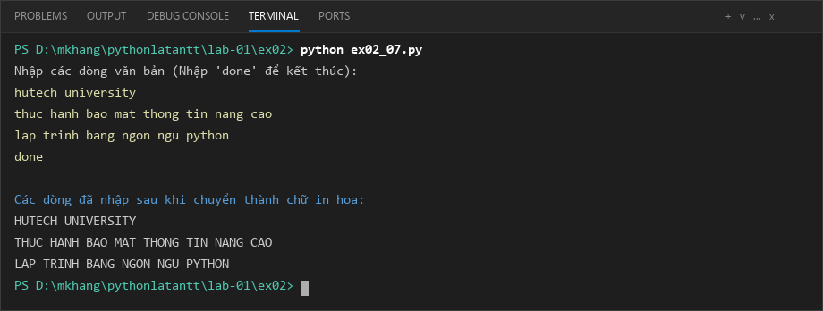

---

### Hình 9: Kết quả thực thi ex02_08.py (Lọc số nhị phân chia hết cho 5)
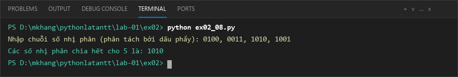

---

### Hình 10: Kết quả thực thi ex02_09.py (Hàm kiểm tra số nguyên tố)
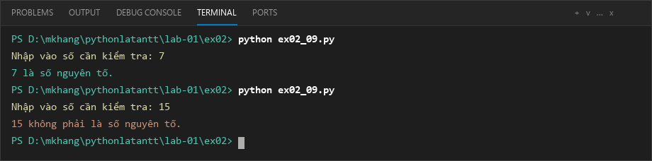

---

### Hình 11: Kết quả thực thi ex02_10.py (Hàm đảo ngược chuỗi)
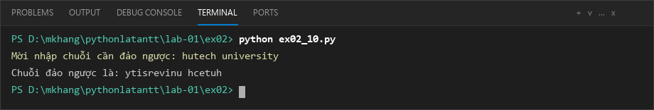

---

### Hình 12: Kết quả thực thi ex03_01.py (Tổng các số chẵn trong List)
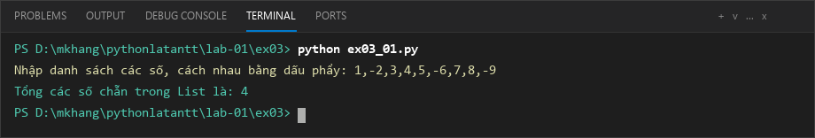

---

### Hình 13: Kết quả thực thi ex03_02.py (Đảo ngược List)
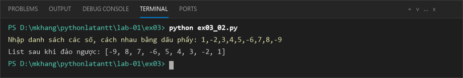

---

### Hình 14: Kết quả thực thi ex03_03.py (Tạo Tuple từ List)
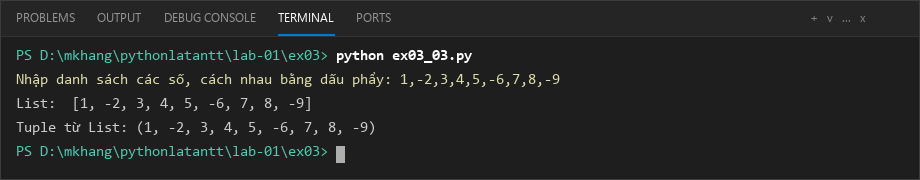

---

### Hình 15: Kết quả thực thi ex03_04.py (Truy cập phần tử đầu và cuối Tuple)
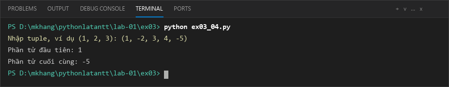

---

### Hình 16: Kết quả thực thi ex03_05.py (Đếm tần suất từ vào Dictionary)
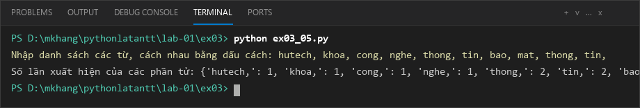

---

### Hình 17: Kết quả thực thi ex03_06.py (Xóa phần tử Dictionary theo khóa)
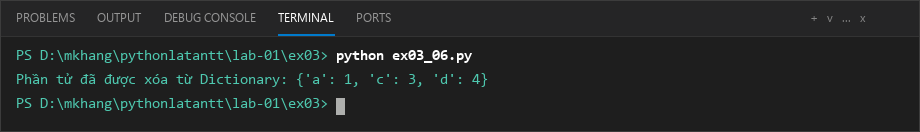

---

### Hình 18: Kết quả thực thi Main.py (Ứng dụng Quản lý Sinh viên OOP)
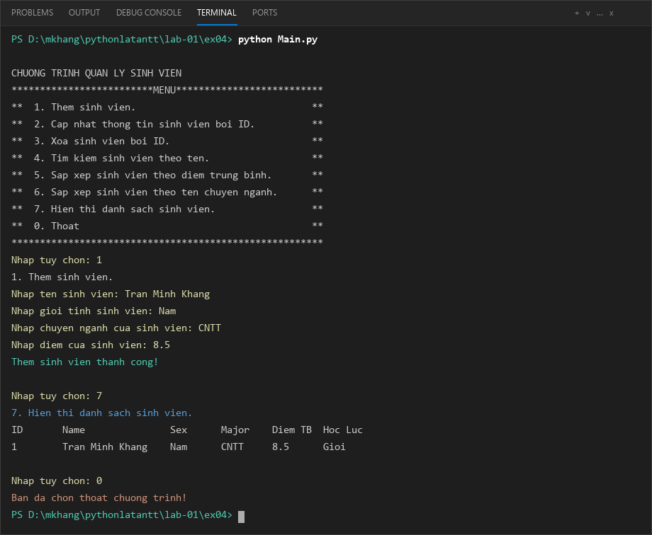

---

### Hình 19: Trạng thái Git Status và Push toàn bộ mã nguồn lên GitHub
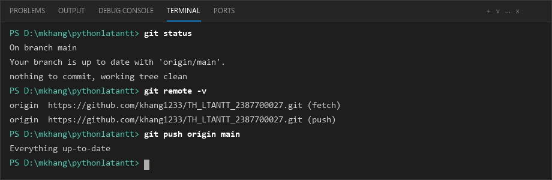
